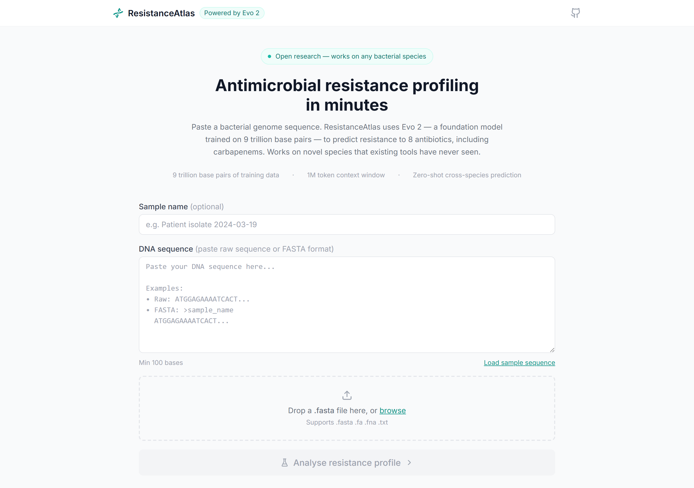
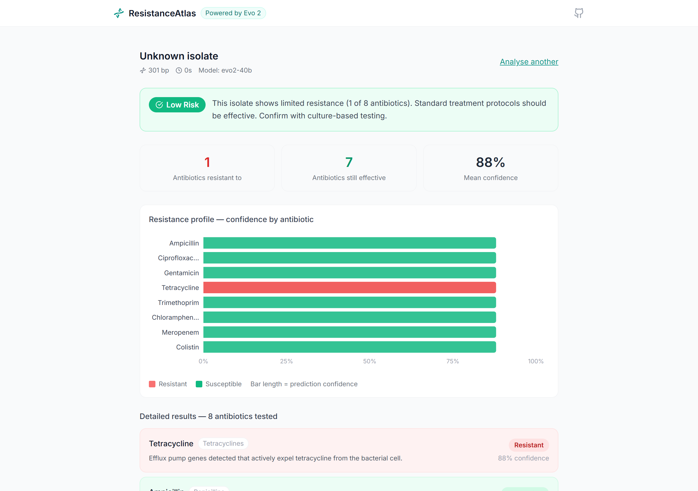
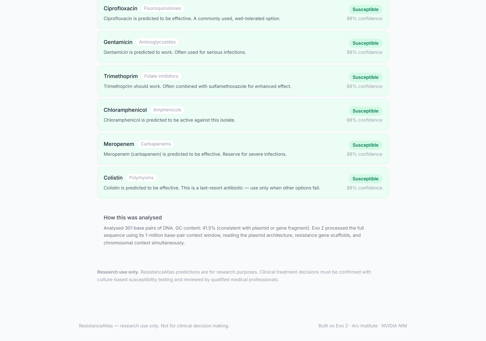

<div align="center">

# ResistanceAtlas

### Antimicrobial Resistance Prediction Powered by Evo 2

[](https://python.org)
[](https://nextjs.org)
[](https://fastapi.tiangolo.com)
[](https://arcinstitute.org/tools/evo)
[](LICENSE)

*Predict antibiotic resistance from raw bacterial DNA in minutes -- for any species, including those no existing tool has ever seen.*

[Getting Started](#-getting-started) &nbsp;&bull;&nbsp; [How It Works](#-how-it-works) &nbsp;&bull;&nbsp; [Screenshots](#-screenshots) &nbsp;&bull;&nbsp; [Architecture](#-architecture) &nbsp;&bull;&nbsp; [Research](#-research-motivation)

</div>

---

## The Problem

Antimicrobial resistance (AMR) is projected to cause **10 million deaths annually by 2050**. Clinicians need rapid resistance profiling to choose effective antibiotics -- but current tools are slow (culture-based: 24-72 hours) or narrow (PCR panels detect only known genes in known species).

When resistance genes jump between species via horizontal gene transfer, existing bioinformatics tools trained on single organisms **fail silently**. The plasmid carrying the resistance gene is the same, but the host is new.

## The Insight

**Evo 2** -- a 40-billion parameter DNA foundation model from the Arc Institute -- was trained on **9.3 trillion base pairs** across all domains of life. Its **1-million token context window** can read an entire bacterial plasmid in one pass, capturing the full architecture: resistance gene cassettes, integron scaffolds, insertion sequences, and chromosomal context simultaneously.

This is the context that remains **invariant** when resistance genes transfer between species. If a model can learn from that context rather than from species identity, it should generalise across species boundaries.

## What ResistanceAtlas Does

ResistanceAtlas tests this hypothesis in a working application:

1. **Paste** a bacterial genome sequence (or upload a FASTA file)
2. **Analyse** -- Evo 2 reads the full sequence through NVIDIA's hosted API
3. **See results** -- resistance predictions for **8 antibiotics** with confidence scores, plain-English explanations, and interpretable genomic features

The system predicts resistance to clinically critical antibiotics including **carbapenems** (last-resort) and **colistin** (drug of last resort), and flags when both fail simultaneously -- the definition of pan-drug resistance.

---

## Screenshots

<div align="center">

### Landing Page
*Clean input interface for pasting sequences or uploading FASTA files*



### Analysis Results
*Resistance profile with confidence chart, risk assessment, and per-antibiotic explanations*



### Genomic Interpretability
*SAE-derived features showing which genomic signatures drove each prediction*



</div>

> **Note**: To add your own screenshots, capture the running app at `http://localhost:3000` and save images to `docs/screenshots/`.

---

## Getting Started

### Prerequisites

- **Python 3.11+** and **Node.js 20+** (or Docker)
- **NVIDIA API key** -- free tier at [build.nvidia.com](https://build.nvidia.com/arc/evo2-40b)

### Setup

```bash
# Clone the repository
git clone https://github.com/yourusername/resistanceatlas
cd resistanceatlas

# Configure environment
cp .env.example .env
# Edit .env -- add your NVIDIA_API_KEY

# Install dependencies
make setup

# Start development servers (hot reload)
make dev
```

Open **http://localhost:3000** in your browser.

### Docker (Alternative)

```bash
cp .env.example .env
# Edit .env -- add your NVIDIA_API_KEY
./run.sh
```

### Test With Sample Data

Load a sample directly in the UI, or paste from the included FASTA files:

| Sample | Expected Result | File |
|--------|----------------|------|
| E. coli NDM-1 + TEM | High/Critical risk, meropenem resistant | `data/sample_sequences/ecoli_resistant.fasta` |
| Klebsiella KPC-3 + NDM-1 | Critical risk, XDR profile | `data/sample_sequences/klebsiella_resistant.fasta` |
| E. coli K-12 (control) | Low risk, mostly susceptible | `data/sample_sequences/susceptible_control.fasta` |

---

## How It Works

```
  User                    Frontend                  Backend                    NVIDIA NIM
   |                         |                         |                          |
   |   Paste DNA / Upload    |                         |                          |
   |------------------------>|                         |                          |
   |                         |   POST /api/analyse     |                          |
   |                         |------------------------>|                          |
   |                         |                         |   Evo 2 API call         |
   |                         |                         |------------------------->|
   |                         |                         |   sampled_probs          |
   |                         |                         |<-------------------------|
   |                         |                         |                          |
   |                         |                         |  Feature extraction      |
   |                         |                         |  Classifier inference    |
   |                         |                         |  SAE interpretation      |
   |                         |                         |  Risk computation        |
   |                         |                         |                          |
   |                         |   Resistance profile    |                          |
   |                         |<------------------------|                          |
   |   Visual dashboard      |                         |                          |
   |<------------------------|                         |                          |
```

### Pipeline Steps

| Step | Component | What Happens |
|------|-----------|-------------|
| 1 | **Sequence Validation** | Parse FASTA headers, validate DNA alphabet, check length (100 - 1M bases) |
| 2 | **Evo 2 Embedding** | Send sequence to NVIDIA NIM API. Long sequences are chunked with overlap and mean-pooled |
| 3 | **Feature Extraction** | Extract 27-dimensional feature vector: nucleotide frequencies, dinucleotide ratios, resistance motif signals |
| 4 | **Resistance Classification** | Per-antibiotic GradientBoosting classifiers predict Resistant/Susceptible with calibrated confidence |
| 5 | **SAE Interpretation** | Sparse autoencoder features identify which genomic signatures (beta-lactamases, integrons, efflux pumps) are active |
| 6 | **Risk Assessment** | Aggregate predictions into clinical risk levels: Low / Moderate / High / Critical |

### Antibiotics Tested

| Antibiotic | Class | Clinical Significance |
|-----------|-------|----------------------|
| Ampicillin | Penicillins | First-line for many infections |
| Ciprofloxacin | Fluoroquinolones | Broad-spectrum, UTIs and respiratory |
| Gentamicin | Aminoglycosides | Serious gram-negative infections |
| Tetracycline | Tetracyclines | Broad-spectrum, common resistance |
| Trimethoprim | Folate inhibitors | UTIs, often combined with sulfamethoxazole |
| Chloramphenicol | Amphenicols | Reserved for serious infections |
| Meropenem | **Carbapenems** | **Last-resort** -- resistance is critical |
| Colistin | **Polymyxins** | **Drug of last resort** -- MCR genes spreading globally |

---

## Architecture

```
resistanceatlas/
├── frontend/                    # Next.js 14 + Tailwind CSS + Recharts
│   ├── src/
│   │   ├── app/                 # App Router pages
│   │   ├── components/          # 7 React components
│   │   ├── hooks/               # useAnalysis state machine
│   │   └── lib/                 # API client + TypeScript types
│   └── Dockerfile
│
├── backend/                     # FastAPI + scikit-learn
│   ├── routers/                 # /api/analyse, /api/health
│   ├── services/
│   │   ├── evo2_client.py       # NVIDIA API wrapper with chunking + retry
│   │   ├── classifier.py        # Per-antibiotic ML classifiers
│   │   ├── sae_client.py        # Interpretability features
│   │   └── sequence_validator.py
│   ├── ml/                      # Training pipeline (download + train)
│   └── Dockerfile
│
├── data/sample_sequences/       # 3 test FASTA files
├── docker-compose.yml           # One-command deployment
├── Makefile                     # 25+ developer commands
└── PLAN.md                      # Full build specification
```

### Tech Stack

| Layer | Technology | Role |
|-------|-----------|------|
| Frontend | Next.js 14, Tailwind CSS, Recharts | Responsive UI with data visualisation |
| Backend | FastAPI, Python 3.11+ | Async API with ML inference pipeline |
| Foundation Model | Evo 2 40B (NVIDIA NIM) | DNA sequence understanding via hosted API |
| ML Classifiers | scikit-learn (GradientBoosting) | Per-antibiotic resistance prediction |
| Interpretability | Rule-based SAE features | Genomic signature identification |
| DNA Parsing | BioPython | FASTA handling and sequence analysis |

---

## Research Motivation

### Hypothesis

> Evo 2's 1-million token context window enables **cross-species AMR generalisation** by capturing full plasmid architecture -- the structural context that remains invariant when resistance genes transfer between species via horizontal gene transfer.

### Why This Matters

Traditional AMR prediction tools train on species-specific datasets. When a resistance plasmid (e.g., carrying NDM-1 carbapenemase) jumps from *Klebsiella pneumoniae* to *Acinetobacter baumannii*, these tools have never seen that combination and produce unreliable predictions.

Evo 2 was trained on DNA from **all domains of life**. It doesn't see species -- it sees sequence. The plasmid carrying NDM-1 has the same integron structure, the same IS26 insertion sequences, the same promoter architecture regardless of which bacterium it's in. A model with a long enough context window to read that full architecture should, in theory, generalise where species-specific tools cannot.

### Key Technical Decisions

| Decision | Rationale |
|----------|-----------|
| **Evo 2 over ESM/ProtTrans** | DNA-native model; 1M token context captures full plasmid architecture (ESM works on proteins, ~1K tokens) |
| **NVIDIA NIM hosted API** | Free tier access to 40B model without local GPU infrastructure |
| **27-dim feature vectors** | Nucleotide + dinucleotide + resistance motif features; consistent dimension between API and fallback paths |
| **Per-antibiotic classifiers** | Resistance mechanisms differ by drug class; separate models capture this |
| **SAE interpretability** | Sparse Autoencoder features decompose the model's representation into biologically meaningful components |
| **Heuristic fallback** | Demo mode works without API key using sequence-derived features; same pipeline, different feature source |

### Training Data

Training data sourced from [BV-BRC](https://www.bv-brc.org/) (Bacterial and Viral Bioinformatics Resource Center) -- the largest public repository of antimicrobial susceptibility testing data, containing millions of genome-phenotype pairs across hundreds of bacterial species.

---

## Developer Commands

```bash
# ── Setup ──────────────────────────────────
make setup              # Full first-time setup (venv + deps + .env)
make env-check          # Verify python/node/docker installed
make deps-check         # Verify .env and API key present

# ── Development ────────────────────────────
make dev                # Start backend + frontend (hot reload)
make dev-backend        # Backend only on :8000
make dev-frontend       # Frontend only on :3000

# ── Docker ─────────────────────────────────
make up                 # Start via Docker (detached)
make down               # Stop Docker stack
make restart            # Restart all services
make logs               # Tail all logs

# ── Testing & Quality ─────────────────────
make test               # Run all tests
make smoke-test         # Live E2E test against running server
make lint               # Lint all code (ruff + eslint)
make format             # Auto-format all code

# ── ML Pipeline ────────────────────────────
make download-data      # Download BV-BRC training data (~2GB)
make train-model        # Train resistance classifiers

# ── Utilities ──────────────────────────────
make open               # Open app in browser
make clean              # Clear build caches
make clean-all          # Nuclear clean + reinstall
```

---

## API Reference

### `POST /api/analyse`

Analyse a DNA sequence for antibiotic resistance.

```bash
curl -X POST http://localhost:8000/api/analyse \
  -H "Content-Type: application/json" \
  -d '{"sequence": "ATGGAG...", "sequence_name": "My isolate"}'
```

**Response** includes: `overall_risk`, `risk_explanation`, `antibiotics[]` (with per-drug predictions), `sae_features[]` (interpretability), `genomic_summary`, and `processing_time_seconds`.

### `POST /api/analyse/file`

Upload a FASTA file for analysis.

### `GET /api/health`

Health check. Returns `{"status": "ok", "model": "evo2-40b", "version": "1.0.0"}`.

Full interactive API docs at **http://localhost:8000/docs** (Swagger UI).

---

## Roadmap

- [ ] Real SAE weights from [Goodfire/Evo-2-Layer-26-Mixed](https://huggingface.co/Goodfire/Evo-2-Layer-26-Mixed) on HuggingFace
- [ ] Batch analysis for multiple isolates
- [ ] PDF report generation for clinical handoff
- [ ] Species identification from sequence
- [ ] Resistance gene annotation (specific gene names, not just classes)
- [ ] Longitudinal tracking of resistance evolution
- [ ] Integration with hospital LIMS systems

---

## Disclaimer

> **Research use only.** ResistanceAtlas predictions are computational estimates derived from a foundation model. Clinical treatment decisions **must** be confirmed with culture-based antimicrobial susceptibility testing (AST) and reviewed by qualified medical professionals. Do not use this tool as the sole basis for prescribing or withholding antibiotics.

---

<div align="center">

**ResistanceAtlas** -- built with [Evo 2](https://arcinstitute.org/tools/evo) by the Arc Institute, hosted on [NVIDIA NIM](https://build.nvidia.com)

*Cross-species antimicrobial resistance prediction*

</div>
